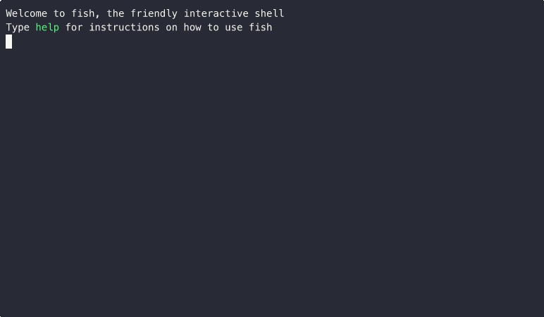

# RfcReader

This is a simple gem that makes it easy to find and read RFCs listed on `rfc-editor.com`.

Note: This gem is not directly affiliated with `rfc-editor.com`. It's just a hobby project.

## Installation

```console
gem install rfc-reader
```

## Example



## Usage

```
>>> rfc-reader

This command downloads the plaintext version of RFCs from
rfc-editor.org so that they can be read at the command line.

The last 100 downloaded RFCs are saved locally so that they can be
read later on without the need for an internet connection.

Commands:
  rfc-reader help [COMMAND]  # Describe available commands or one specific command
  rfc-reader library         # List already downloaded RFCs for reading
  rfc-reader recent          # List recent RFC releases for reading
  rfc-reader search [TERM]   # Search for RFCs by TERM for reading
  rfc-reader version         # Print the program version
```

## Development

After checking out the repo, run `bin/setup` to install dependencies. Then, run `rake spec` to run default tests and `rake spec:online` to run online integration tests. Run the linter with `rake lint` and run safe autocorrect with `rake fix`. You can also run `bin/console` for an interactive prompt that will allow you to experiment.

To install this gem onto your local machine, run `bundle exec rake install`. To release a new version, update the version number in `version.rb`, and then run `bundle exec rake release`, which will create a git tag for the version, push git commits and the created tag, and push the `.gem` file to [rubygems.org](https://rubygems.org).

## Contributing

Bug reports and pull requests are welcome on GitHub at https://github.com/apainintheneck/rfc-reader.

## License

The gem is available as open source under the terms of the [MIT License](https://opensource.org/licenses/MIT).
